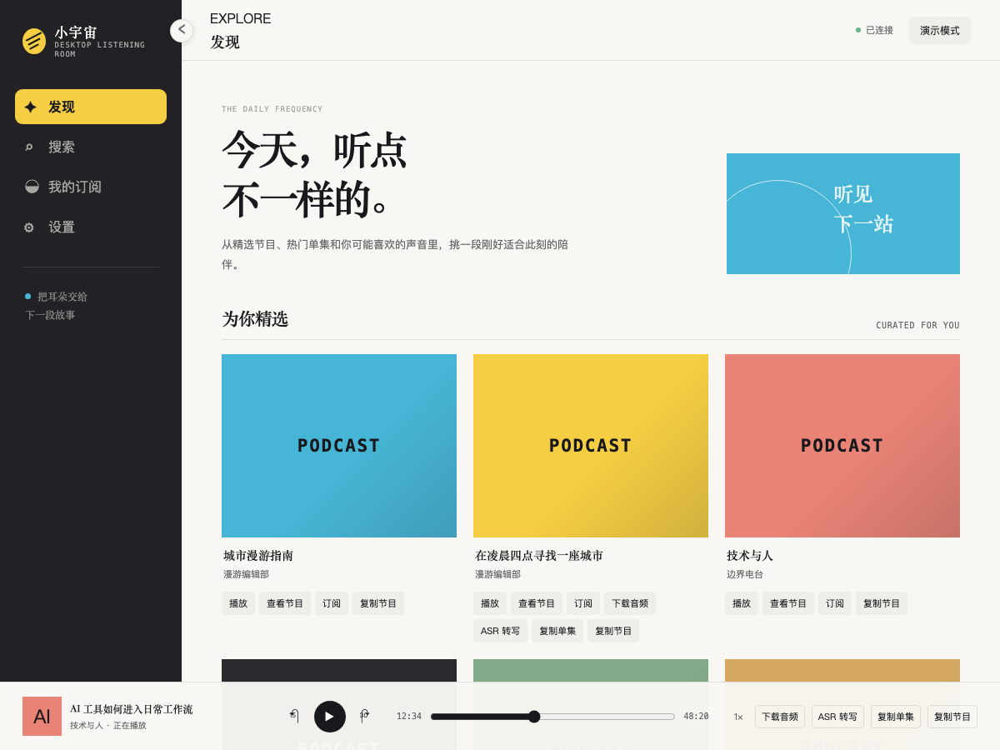
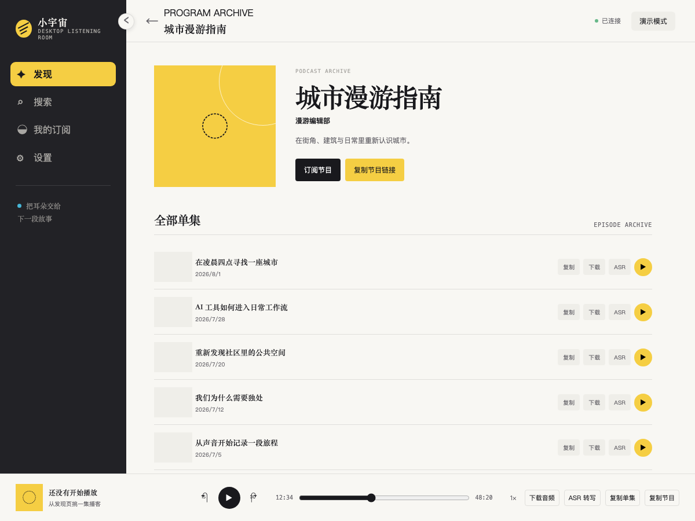
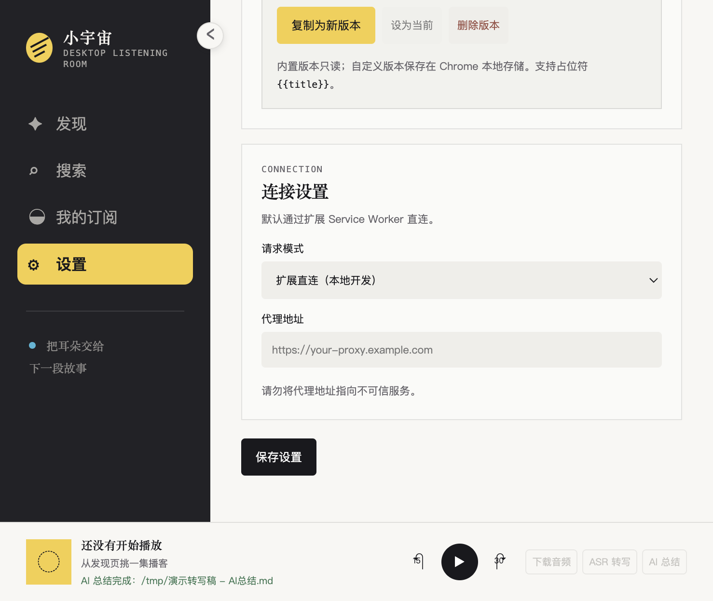

# 小宇宙桌面版（非官方）

一个面向 macOS 的非官方小宇宙 Chrome 扩展，提供独立桌面窗口、节目发现与搜索、订阅管理、音频下载、云端 ASR 转写和多模型 AI 总结。

> 本项目与小宇宙官方无隶属、授权或合作关系。请遵守小宇宙及所选云服务的使用条款，并仅处理你有权访问的内容。

## 功能预览

> 以下截图使用合成演示数据，不包含真实账号、API Key 或本机目录。

### 发现与桌面播放器



发现页集中展示节目与单集；卡片可直接播放、订阅、下载、转写或复制链接。底部播放器提供进度、倍速和当前单集操作。

### 节目详情与单集列表



从发现、搜索或“我的订阅”进入节目详情，查看节目介绍和单集列表，并对指定单集执行播放、下载、ASR 转写和链接复制。

### 下载、ASR 与 AI 总结设置



音频与转写稿可分别指定 macOS 绝对保存目录。ASR 支持 Qwen 与豆包；AI 总结支持 Qwen、豆包、DeepSeek、Kimi 和 GLM，并提供本地 Prompt 版本管理。API Key 由 Native Host 保存到 macOS Keychain。

## 功能

- 发现、搜索和查看已订阅节目
- 查看节目详情及单集列表
- 播放单集，复制节目或单集链接
- 下载音频到浏览器默认目录或 macOS 绝对路径
- 使用 Qwen 或豆包 API 转写长音频
- 将转写结果保存为本地 Markdown 文档
- 使用 Qwen、豆包、DeepSeek、Kimi 或 GLM 总结转写稿
- 管理 AI 总结 Prompt 版本，内置结构化播客总结 Prompt
- 自动分段总结长转写稿并输出独立 Markdown 文档
- 折叠侧栏和独立播放器控制

## 环境要求

- macOS
- Google Chrome 110 或更高版本
- 系统自带的 `/usr/bin/python3`
- 可选：`ffmpeg`。豆包或 Fun-ASR 处理部分 M4A 音频时需要
- 如需 ASR 或 AI 总结：对应服务的 API Key

安装 `ffmpeg`：

```bash
brew install ffmpeg
```

## 安装

### 1. 获取代码

```bash
git clone https://github.com/QWE38qwe/xiaoyuzhou-desktop.git
cd xiaoyuzhou-desktop
```

### 2. 加载 Chrome 扩展

1. 打开 `chrome://extensions`
2. 开启右上角“开发者模式”
3. 点击“加载已解压的扩展程序”
4. 选择本仓库根目录
5. 记录扩展卡片显示的扩展 ID

### 3. 安装 Native Host

Native Host 用于目录选择、绝对路径下载、Keychain 凭据读写，以及转写稿和总结文档落盘。

```bash
chmod +x install_native_host.sh
./install_native_host.sh <你的扩展ID>
```

安装后，在 `chrome://extensions` 中重新加载扩展。

如果移动了仓库目录、扩展 ID 发生变化，需使用新 ID 重新运行安装脚本。

## 使用

1. 点击扩展图标打开桌面窗口
2. 登录小宇宙账号
3. 在“设置”中配置音频和转写稿保存目录
4. 选择 Qwen 或豆包并保存 API Key
5. 在单集卡片、节目列表或播放器中点击“ASR 转写”
6. 在播放器中点击“AI 总结”，或在设置页选择已有 Markdown 转写稿

默认 Qwen 长音频模型：

```text
qwen-audio-3.0-asr-flash-filetrans
```

新转写稿保存为：

```markdown
# 节目名称 - 单集名称

## 转写正文

转写内容……
```

AI 总结默认使用 OpenAI-compatible Chat Completions 接口：

| Provider | 默认接口 | 默认模型 |
| --- | --- | --- |
| Qwen | `https://dashscope.aliyuncs.com/compatible-mode/v1/chat/completions` | `qwen-plus` |
| 豆包 | `https://ark.cn-beijing.volces.com/api/v3/chat/completions` | `doubao-seed-2-1-pro-260628` |
| DeepSeek | `https://api.deepseek.com/chat/completions` | `deepseek-v4-flash` |
| Kimi | `https://api.moonshot.cn/v1/chat/completions` | `kimi-k2.6` |
| GLM | `https://open.bigmodel.cn/api/paas/v4/chat/completions` | `glm-5.2` |

接口地址和模型均可在设置页修改。Native Host 只接受对应 Provider 的官方 HTTPS `chat/completions` 域名。

内置 Prompt 输出一句话摘要、核心结论、内容脉络、关键观点与依据、行动项、人物与术语和不确定信息。内置版本只读，可复制为自定义版本后编辑、切换或删除。长转写稿会自动分段总结并统一去重，结果保存为：

```text
原转写稿名称 - AI总结.md
```

## 隐私与安全

- 小宇宙登录凭证保存在 Chrome 扩展本地存储中
- ASR 和 AI 总结 API Key 由 Native Host 保存到 macOS Keychain，扩展存储和项目文件中不保存明文 Key
- 从旧版本升级时，Native Host 仅在 Keychain 写入并校验成功后删除旧的 `asr_credentials.json`；迁移失败会保留原文件
- 只有主动点击“ASR 转写”后，音频 URL 或音频内容才会发送给所选 ASR 服务
- 只有主动点击“AI 总结”后，转写稿才会发送给所选 AI 服务；首次发送前会显示全文外发与费用确认
- 选择已有 Markdown 时，文件会先复制到已配置的转写稿目录；Native Host 只允许总结该目录内的 Markdown
- 长转写稿按片段发送，Provider 的数据保留策略以对应服务条款为准
- 项目不会把 API Key 写入扩展存储或仓库

请勿将调试日志或包含用户数据的下载文件提交到 Git。

## Chrome 权限

| 权限 | 用途 |
| --- | --- |
| `storage` | 保存扩展设置和登录状态 |
| `windows` | 创建和管理独立桌面窗口 |
| `clipboardWrite` | 复制节目和单集链接 |
| `downloads` | 保存到浏览器默认下载目录 |
| `nativeMessaging` | 调用本地 Native Host |

`host_permissions` 仅覆盖小宇宙 API、认证服务和媒体 CDN。

## 开发检查

```bash
node --check app.js
node --check background.js
/usr/bin/python3 -m py_compile native_host.py
/usr/bin/python3 -m json.tool manifest.json >/dev/null
sh -n install_native_host.sh
```

## 卸载 Native Host

先从 Chrome 删除扩展，然后执行：

```bash
rm -rf "$HOME/Library/Application Support/Xiaoyuzhou Desktop Native Host"
rm -f "$HOME/Library/Application Support/Google/Chrome/NativeMessagingHosts/com.xiaoyuzhou.desktop.json"
security delete-generic-password -s com.xiaoyuzhou.desktop -a asr.qwen 2>/dev/null || true
security delete-generic-password -s com.xiaoyuzhou.desktop -a asr.doubao 2>/dev/null || true
for account in summary.qwen summary.doubao summary.deepseek summary.kimi summary.glm; do
  security delete-generic-password -s com.xiaoyuzhou.desktop -a "$account" 2>/dev/null || true
done
```

## 已知限制

- Native Host 当前仅支持 macOS
- 本项目依赖非公开稳定性承诺的小宇宙接口，接口变化可能导致部分功能失效
- 当前未发布到 Chrome Web Store，需要通过开发者模式安装

## License

[MIT](LICENSE)
